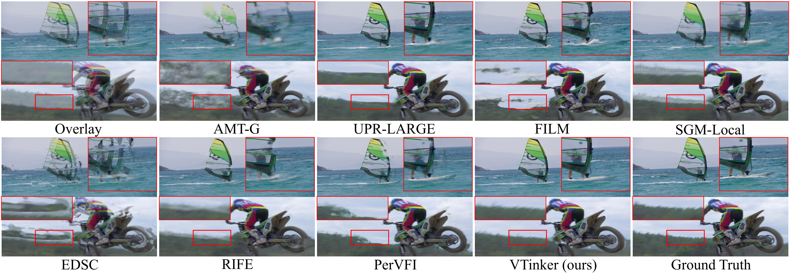

# :fire: VTinker: Guided Flow Upsampling and Texture Mapping for High-Resolution Video Frame Interpolation

<a href='https://arxiv.org/abs/2511.16124'></a> &nbsp;&nbsp;

This is the official PyTorch codes for our AAAI26 paper.

>**VTinker: Guided Flow Upsampling and Texture Mapping for High-Resolution Video Frame Interpolation**<br>  [Chenyang Wu<sup>1</sup>](), [ Jiayi Fu<sup>1</sup>](), [Chun-Le Guo<sup>1,2</sup>](), [Shuhao Han<sup>1</sup>](), [Chongyi Li<sup>1,2,&dagger;</sup>]() <br>
><sup>1</sup> VCIP, CS, Nankai University,  <sup>2</sup> NKIARI, Shenzhen Futian<br>
><sup>&dagger;</sup>Corresponding author.


## Introduction

Due to large pixel movement and high computational cost, estimating the motion of high-resolution frames is challenging. Thus, most flow-based Video Frame Interpolation (VFI) methods first predict bidirectional flows at low resolution and then use high-magnification upsampling (e.g., bilinear) to obtain the high-resolution ones. However, this kind of upsampling strategy may cause blur or mosaic at the flows' edges. Additionally, the motion of fine pixels at high resolution cannot be adequately captured in motion estimation at low resolution, which leads to the misalignment of task-oriented flows. With such inaccurate flows, input frames are warped and combined pixel-by-pixel, resulting in ghosting and discontinuities in the interpolated frame. In this study, we propose a novel VFI pipeline, VTinker, which consists of two core components: guided flow upsampling (GFU) and Texture Mapping. After motion estimation at low resolution, GFU introduces input frames as guidance to alleviate the blurring details in bilinear upsampling flows, which makes flows' edges clearer. Subsequently, to avoid pixel-level ghosting and discontinuities, Texture Mapping generates an initial interpolated frame, referred to as the intermediate proxy. The proxy serves as a cue for selecting clear texture blocks from the input frames, which are then mapped onto the proxy to facilitate producing the final interpolated frame via a reconstruction module. Extensive experiments demonstrate that VTinker achieves state-of-the-art performance in VFI.

### 2K Scenes



### 4K Scenes


## Python and Cuda environment

**Our Python environment is based on the UPR-Net. If you already have this environment installed on your machine, skip the following steps.**

```shell
conda create --name vtinker python=3.8.5
conda activate vtinker
pip install torch==1.13.0+cu117 torchvision==0.14.0+cu117 torchaudio==0.13.0 --extra-index-url https://download.pytorch.org/whl/cu117
pip install cupy_cuda11x
pip install -r requirements.txt 
```

If your Cuda vision is 12.x, we suggest to
replace `pip install cupy_cuda11x` in above command with `pip install cupy_cuda12x`

## Download Pretrained Model and Datasets

#### Pretained Model

Download the pre-trained model files from [here](https://drive.google.com/drive/folders/1vDOo3U9l_MAM5dvpcnoFWb_La5jyHRjS?usp=drive_link) (or on [HuggingFace](https://huggingface.co/wcy1234567/VTinker))and place them in “./checkpoints”. 

#### Datasets

Download datasets, [Vimeo90K](http://toflow.csail.mit.edu/), [UCF101](https://liuziwei7.github.io/projects/VoxelFlow), [SNU-FILM](https://myungsub.github.io/CAIN/), [DAVIS](https://davischallenge.org/davis2017/code.html), [Xiph](https://www.xiph.org/), and place them in “./dataset_train_test”.

## Training on Vimeo90K

Firstly, based on the experimental setting of UPR-Net, we train the redesigned UPR-Net.

#### Redesgined UPR-Net Training

``` shell
CUDA_VISIBLE_DEVICES=0,1,2,3 python3 -m torch.distributed.launch \
    --nproc_per_node=4 --master_port=10000 -m tools.train4ReDesign \
        --world_size=4 \
        --data_root ./dataset_train_test/vimeo_triplet \
        --train_log_root ./train_log \
        --exp_name upr-base \
        --batch_size 8 \
        --nr_data_worker 2
```

Then, you will get the pretrained redesigned UPR-Net, and move it to "./checkpoints/UPR_ReDesgin.pkl"

#### VTinker Training

```shell
CUDA_VISIBLE_DEVICES=0,1,2,3,4,5,6,7 python3 -m torch.distributed.launch \
        --nproc_per_node=8 --master_port=10000 -m tools.train \
        --world_size=8 \
        --data_root  ./dataset_train_test/vimeo_triplet \
        --train_log_root ./train_log \
        --exp_name  VTinker\
        --batch_size 2 \
        --nr_data_worker 2
```

## Using of VTinker

#### For Image

```shell
python -m tools.test_single_case --frame0 ./assets/img0.jpg --frame1 ./assets/img1.jpg --time_period 0.5 --save_dir ./assets/results.jpg --model_file ./checkpoints/VTinker.pkl
```

#### For Video

```shell
python -m tools.test_video --video ./assets/video.mp4 --inter_num 2 --save_dir ./assets/result_video.mp4 --model_file ./checkpoints/VTinker.pkl
```

## Benchmarking scripts

Before starting a new test task, **please clear the temporary file** ("./dataset_train_test/tmp"), or makes a new temporary file.

#### Test on "xiph2k", "davis480p", "davis1080p"

```shell
# Modify the variable "dataset_name" on line 24 to replace the Benchmark.
python -m tools.evaluate_2k 
```

#### Test on "xiph4k", "davis4k"

```shell
# Modify the variable "dataset_name" on line 30 to replace the Benchmark.
python -m tools.evaluate_4k
```

#### Test on SNU-FILM

```shell
python -m tools.evaluate_snufilm
```

#### Test on UCF101

```shell
python -m tools.evaluate_UCF101
```

#### Test on Vimeo90K

```shell
python -m tools.evaluate_vimeo
```


## Acknowledgement

We thank the authors of [UPR-Net](https://github.com/srcn-ivl/UPR-Net) and [PerVFI-VFIBenchmark](https://github.com/mulns/VFIBenchmark) for their excellent work, from which we borrowed some code. When using our code, please ensure you also comply with the licenses of UPR-Net and PerVFI.

## License

This project is licensed under the Pi-Lab License 1.0 - see the [LICENSE](LICENSE) file for details.

## Citation

```
@inproceedings{wu2025vtinker,
  title={VTinker: Guided Flow Upsampling and Texture Mapping for High-Resolution Video Frame Interpolation},
  author={Wu, Chenyang and Fu, Jiayi and Guo, Chun-Le and Han, Shuhao and Li, Chongyi},
  booktitle={AAAI2026},
  year={2025}
}
```

## Contact 

For technical questions, please contact `chenyangwu@mail.nankai.edu.cn`.
